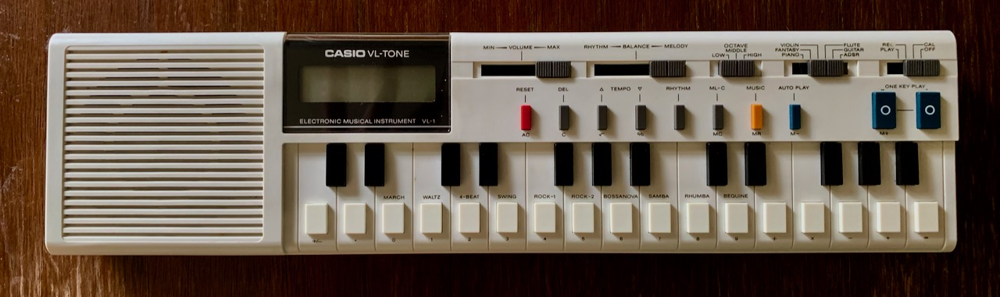

Just about every visit, Dad brings up a bag or two of stuff for me to look through. Junk mail that's still being delivered to me, even though I moved out twenty years ago. A complete set of plastic Lord of the Rings goblets with LEDs in the base. The Othello board game I played every chance I got. On a recent trip, he brought me a Casio VL-Tone.

_The_ Casio VL-Tone. I'd actually forgotten about it.

He says as near as he can remember, he bought it in 1979 while we were living in Nebraska, which explains why I can't really remember a time when we didn't have it. I don't recall us buying it, but I seem to remember it being produced at some point and me falling in love with it. It came with a little book full of songs, and you could play them by pushing the numbered keyboard keys.

So by third grade I was pretty adept at playing the theme from _M*A*S*H_. I also knew the song was called "Suicide is Painless" had knew all the lyrics, which are genuinely cheerful:

> The sword of time will pierce our skin  
> It doesn't hurt when it begins  
> But as it works its way on in  
> The pain grows stronger, watch it grin  

I think this would probably have explained a lot to Ms. Sweeney had she known.

Anyway, I had almost entirely forgotten about it except for the rare instances where I'd run across this song, which uses the VL-Tone's "swing" rhythm:

    <iframe class="embed-responsive-item" width="753" height="565" src="https://www.youtube.com/embed/lNYcviXK4rg" frameborder="0" allow="accelerometer; autoplay; encrypted-media; gyroscope; picture-in-picture" allowfullscreen></iframe>

In the last year and a half, I've gone a lot deeper into the world of music production and composition than I ever anticipated I would, so the sixth voice, which I always called "the addsir" because it was labeled "ADSR." That actually stands for "Attack, Decay, Sustain, Release" and those are the four values that typically make up a note "envelope." makes a lot more sense to me now. I broke out the manual (which was still with the keyboard!) and looked up how to use it. Today, for the first time ever, I got a sound out the ADSR voice that didn't sound like a frog swallowing its tongue.

Another first with the VL-Tone today: I'd always played it through either headphones or the tinny little speaker on the left. I had a brainstorm today and plugged it into a much larger audio system to see what happens. In my experience, things with crappy speakers sound a lot more impressive if you route them through hardware that costs several times the value. That's apparently not true for the VL-Tone, which sounded … exactly the same.

And what does that sound like?

    <iframe class="embed-responsive-item" width="753" height="424" src="https://www.youtube.com/embed/H59GG0gn_HM" frameborder="0" allow="accelerometer; autoplay; encrypted-media; gyroscope; picture-in-picture" allowfullscreen></iframe>

What you're hearing there is the power of (only!) one VCO (voltage controlled oscillator), which I know thanks to this [contemptuous review](http://www.vintagesynth.com/casio/vl1.php) I found. Not that he's wrong. But for me, in third grade, this seemed so much more than a toy. Regardless of what the youtube video above says, the VL-Tone retailed for $80 in 1979, back when a McDonald's Happy Meal was $1 and the average rent was less than $300. And it was the closest thing to a real instrument I had for many many years.

So thank you, Dad, for bringing me that VL-Tone (and for buying it in the first place). It's one of the artifacts from my childhood I treasure the most.

The junk mail, on the other hand, I probably could use less of.

